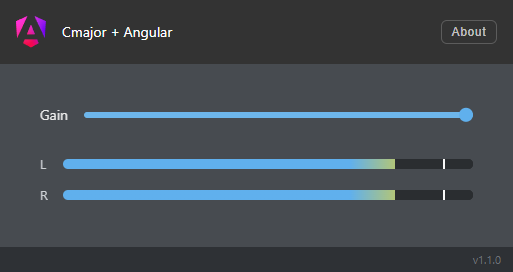

# Cmajor + Angular

Proof of concept [cmajor] gain fx patch with [angular] gui built to a single web component.

To test the patch simply run `pnpm install` and `pnpm run build`. Afterward, drag the .cmajorpatch from
the dist directory to the cmaj-plugin within your daw or play the patch via the cmaj command line tool.

For development use `pnpm start` to rebuild the patch on change.

Setup: Angular, vitest, eslint, prettier, husky + lintstaged
Tested with Cmajor Version: 1.0.2944 running the cmaj-plugin in Bitwig v6 on Windows 11.

#### Known issues / future improvements

- currently running the patch via the vscode extension does not seem to work
- when loading a patch, the default values don't seem to be reflected inside the host

#### 🔊 [Spotify] / [Apple Music] / [Bandcamp] / [Soundcloud]

[cmajor]: https://github.com/cmajor-lang/cmajor
[angular]: https://angular.dev/
[esbuild]: https://esbuild.github.io/
[Spotify]: https://open.spotify.com/artist/2jOQrKX3rRoZORPfFcXaYU
[Apple Music]: https://music.apple.com/us/artist/loowps/1326334750
[Bandcamp]: https://loowps.bandcamp.com
[Soundcloud]: https://soundcloud.com/loowps
