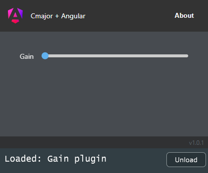

# Cmajor + Angular

Proof of concept [cmajor] gain fx patch with [angular] gui.

Use `npm run build` and afterwards load the .cmajorpatch within the dist directory via the cmaj plugin within a daw.

Angular 15 with standalone components, jest, eslint, prettier, husky + lintstaged.

#### Known issues / future improvements

- patch run in vscode does not display any gui (probably caused by the iframe, loading the patch via cmajor plugin in a
  daw works)
- with `npm run watch` the patch is rebuild on change, but you have to manually reload the patch inside the plugin
- the pointer lock api causes a notification within the webview to use the ESC button
- when loading a patch the default values don't seem to be reflected inside the host (this also happens with other
  example patches without custom gui)

#### 🔊 [Spotify] / [Apple Music] / [Bandcamp] / [Soundcloud]

[cmajor]: https://github.com/SoundStacks/cmajor
[angular]: https://angular.io/
[Spotify]: https://open.spotify.com/artist/2jOQrKX3rRoZORPfFcXaYU
[Apple Music]: https://music.apple.com/us/artist/loowps/1326334750
[Bandcamp]: https://loowps.bandcamp.com
[Soundcloud]: https://soundcloud.com/loowps
